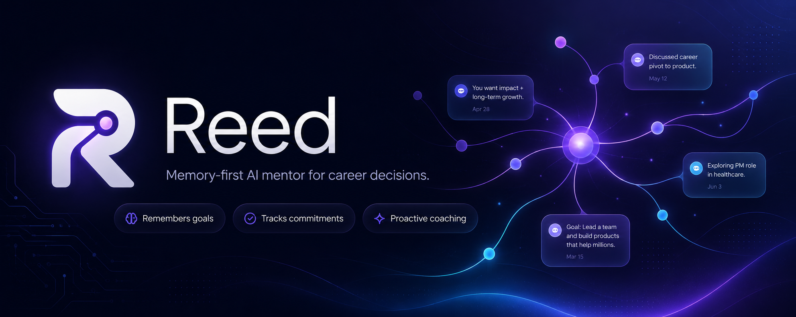

<p align="center">
  
</p>

# Reed

Reed is a memory-first AI mentor for career decisions, applications, and follow-through. The demo is designed around one core behavior: Reed opens a conversation with useful context before the user types, based on prior goals, patterns, and commitments.

Live app: https://ask-reed.vercel.app

Roadmap: [ROADMAP.md](./ROADMAP.md)

## What It Demonstrates

- Proactive session opening based on stored commitments and behavioral signals.
- A chat interface that keeps long-running career context visible without replaying raw transcripts into the UI.
- Resume and document attachments, with extracted text stored separately from the visible message content.
- Past conversations in a read-only transcript viewer, including attachment chips without exposing raw attachment text.
- Supabase-backed authentication, row-level security, and seeded demo data.

## Tech Stack

- **Next.js 16** App Router
- **React 19** and TypeScript
- **Vercel AI SDK** with Anthropic Claude
- **Supabase** for auth, Postgres, and row-level security
- **Tailwind CSS 4**
- **pdf-parse** for text-based PDF extraction

## Project Structure

```text
app/
  api/chat/              streamed chat route and memory persistence
  api/extract-pdf/       PDF text extraction endpoint
  api/session-context/   current memory snapshot endpoint
  auth/callback/         Supabase auth callback
  chat/                  authenticated chat page
  login/                 auth page
components/
  login-form.tsx         email/password and Google auth
  reed-app.tsx           main chat experience
  session-memory-peek.tsx memory sidebar and transcript viewer
lib/
  chat/                  model constants and system prompt
  coaching-logic/        session context and proactive nudge logic
  memory/                structured memory extraction
  supabase/              browser, server, and admin clients
scripts/
  seed-demo.ts           resets and seeds the demo account
supabase/migrations/     database schema
```

## Environment Variables

Create `.env.local` with:

```bash
NEXT_PUBLIC_SUPABASE_URL=
NEXT_PUBLIC_SUPABASE_ANON_KEY=
SUPABASE_SERVICE_ROLE_KEY=
ANTHROPIC_API_KEY=
DEMO_USER_PASSWORD=
```

`SUPABASE_SERVICE_ROLE_KEY` is server-only. Do not expose it in the browser or prefix it with `NEXT_PUBLIC_`.

## Supabase Setup

Apply the migrations in order:

```text
supabase/migrations/001_initial_schema.sql
supabase/migrations/002_message_attachments.sql
```

The second migration adds:

```sql
attachment_filename text
attachment_text text
```

to `public.messages`. These columns are required for attachment persistence and follow-up questions over uploaded content.

For auth, configure:

```text
Site URL: https://ask-reed.vercel.app
Redirect URLs:
  https://ask-reed.vercel.app/auth/callback
  http://localhost:3000/auth/callback
```

## Demo Data

Seed the demo account:

```bash
npm run seed:demo
```

The seed script resets Maya's existing demo data before inserting the canonical demo state:

- 2 sessions
- 8 transcript messages
- 1 active goal
- 1 behavioral signal
- 1 open commitment

This keeps the founder demo from accumulating noisy manual-test sessions.

## Local Development

Install dependencies:

```bash
npm install
```

Start the dev server:

```bash
npm run dev
```

Open:

```text
http://localhost:3000
```

## Quality Checks

Run before shipping:

```bash
npm run type-check
npm run lint
npm run build
```

## Core Demo Flow

1. Sign in with the seeded demo account.
2. Reed should open with a proactive nudge about the unresolved product-adjacent role commitment.
3. Ask a real career or resume question.
4. Upload a text-based resume file.
5. Ask about the uploaded content.
6. Send an unrelated message.
7. Ask about the uploaded content again and confirm Reed still uses the attachment context.
8. Open Past Conversations and verify the transcript is read-only, ordered, and renders attachment chips instead of raw attachment text.

## Deployment

The app is deployed on Vercel. After pushing to `main`, Vercel redeploys the production app at:

```text
https://ask-reed.vercel.app
```
